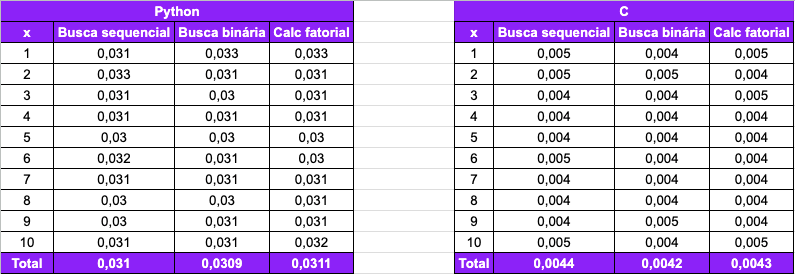
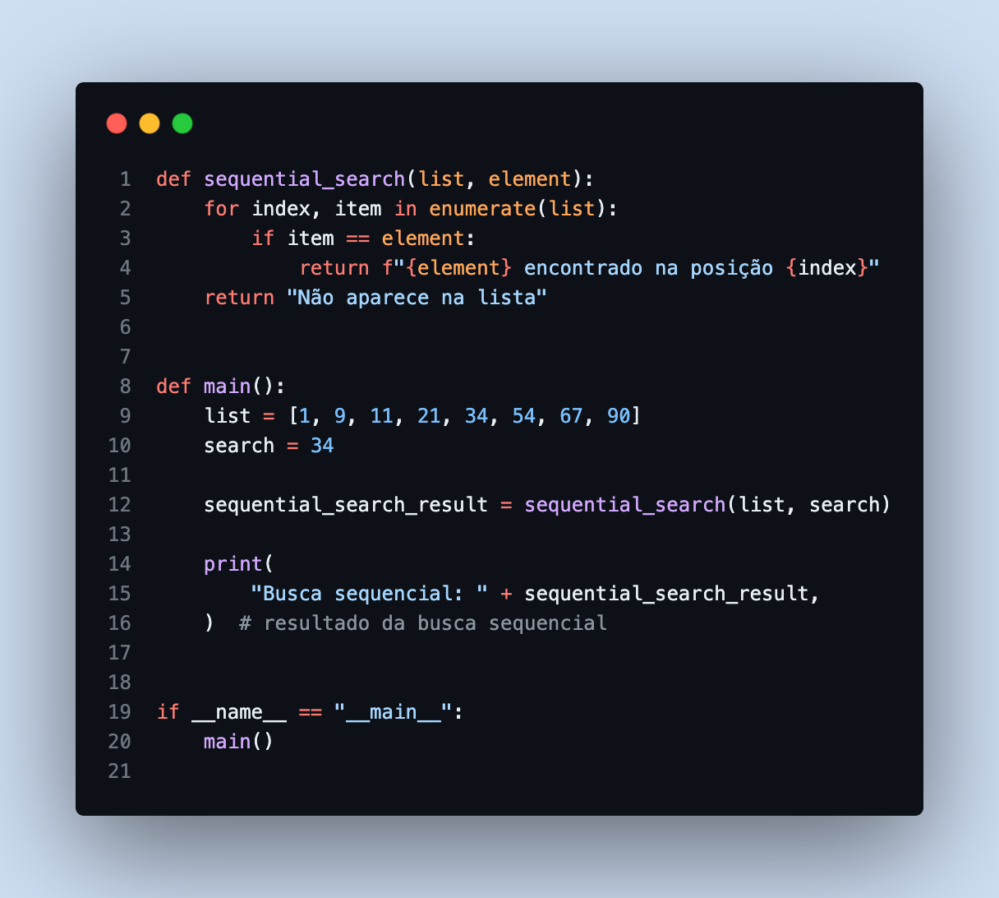
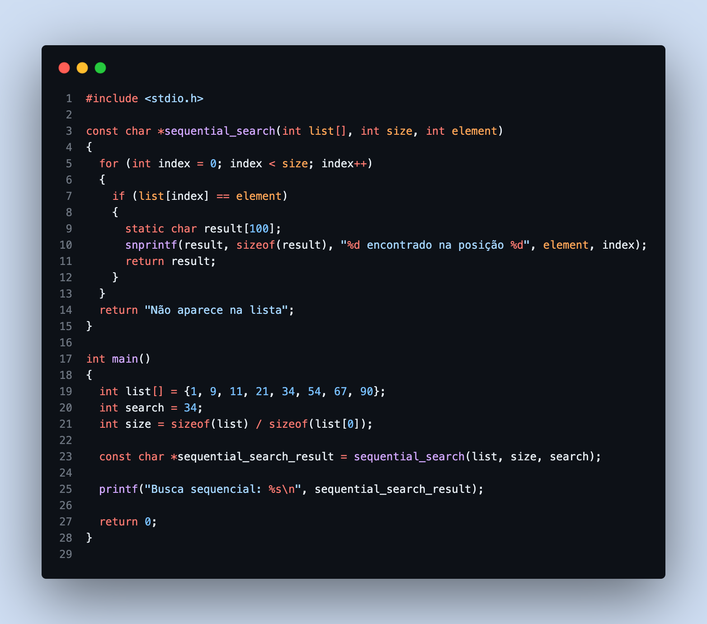
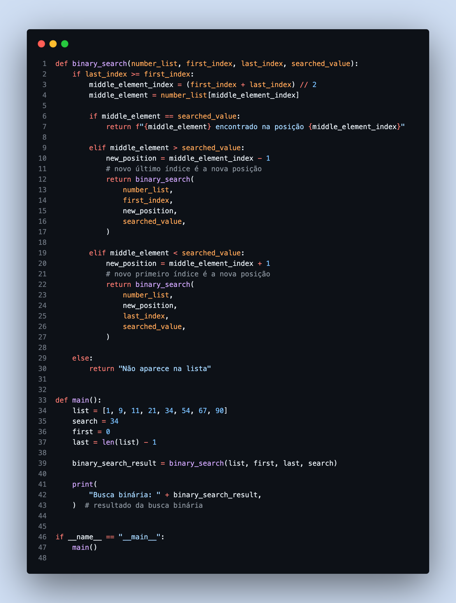
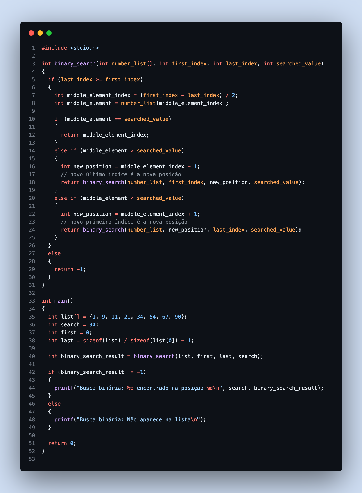
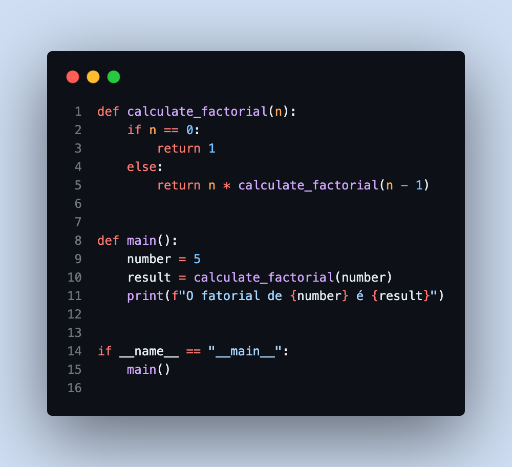
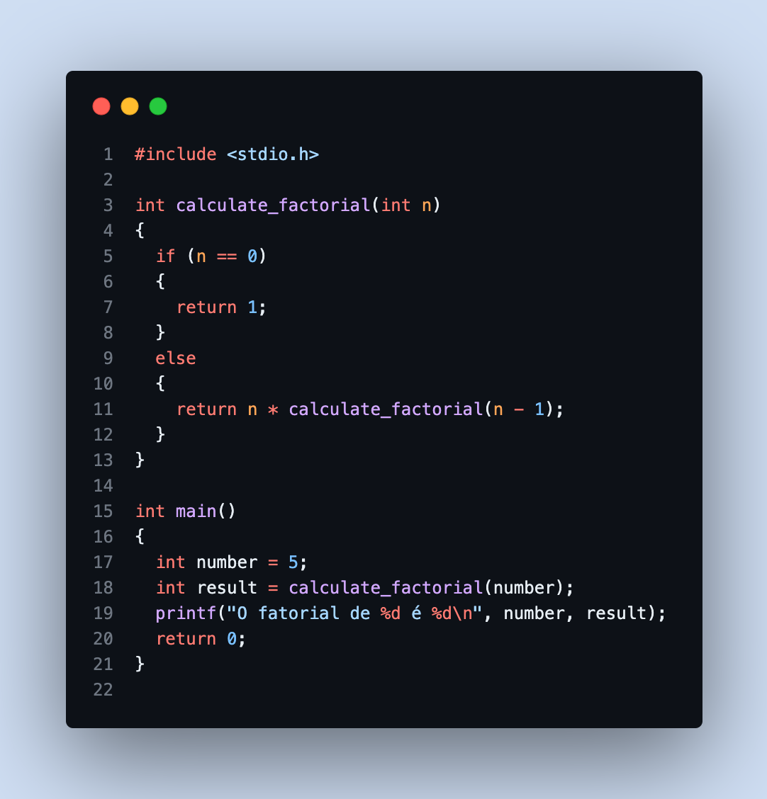

# Atividade 19/09/2023
## Estruturas de Dados e Análise de Algoritimos

### Resultado

### Busca sequencial
* Python
  

* C
  

### Busca binária
* Python
  

* C
  

### Calc fatorial
* Python
  

* C
  
